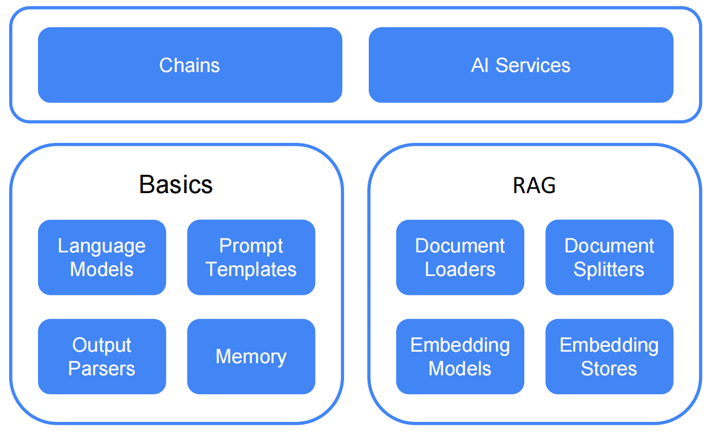

# Hello-LangChain4j

reference:
1. https://langchain4j.github.io/langchain4j/
2. https://github.com/feuyeux/hello-langchain

## About LangChain4j
### 2 levels of abstraction
1. **Low level**: the "primitives" of your LLM-powered application. You have complete control over how to combine them, but you will need to write more code in the imperative style.
2. **High level**: At this level, you interact with LLMs using high-level APIs like AiServices and Chains, which hides all the complexity and boilerplate from you.

